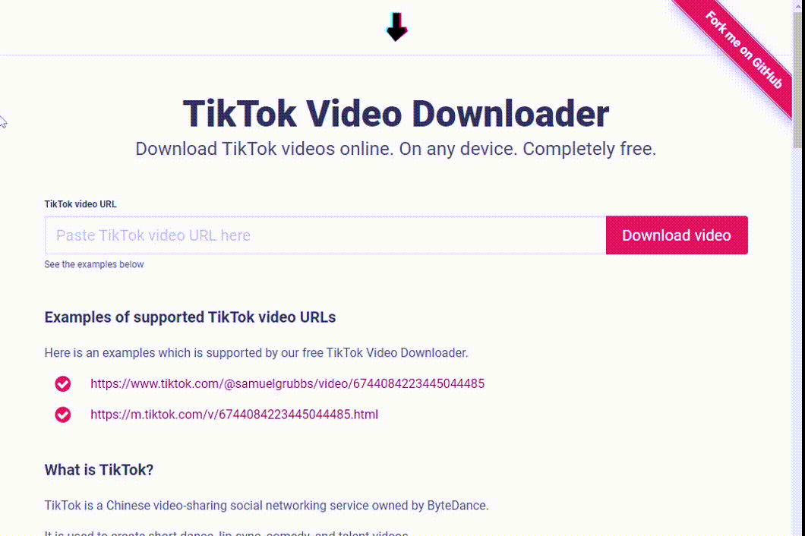

# TikTok Video Downloader

> Download TikTok videos online with TikTok Video Downloader. Completely free.

[](https://opensource.org/licenses/MIT)

<a href="https://www.buymeacoffee.com/zanozbot">
  
</a>

## About

I created TikTok Video Downloader with the intention of learning a new technology.
It was designed to be used as an standalone app, so you are not required to install anything else.
As long as you are online and with a TikTok video link you are all set and ready to download.
After the video link has been processed, you will be able to download the video as a mp4.



## Getting started

Navigate to [Firebase Console](https://console.firebase.google.com/) and create a new project.
Create a new app, copy the config and replace the lines 148-155 in `nuxt.config.js` with your app's config.

In the Firebase Console configure Firebase Hosting, Firebase Functions, and enable Firebase Analytics. In order to use Firebase Functions you'll have to upgrade your project to a paid version. Keep in mind Google has a very generous free plan.

> Always set a budget limit for you projects.

Finally, navigate to the project in your console of choice and link your newly created Firebase project.

```bash
$ firebase init
```

Select to use Firebase Functions and Firebase Hosting. Do the same for the emulators. Keep all the defaults export change the public folder to `dist`. Press `n` for all overrides.

## Install

### Website

Run `npm install` to install the website's dependencies.

### Firebase Functions

Navigate to the `functions` folder and run `npm install` to install the functions' dependencies.

## Local development

### Website

Run `npm run dev` navigate to http://localhost:3000/. The app will automatically reload if you change any of the source files.

### Firebase functions

Navigate to `functions` folder and run `npm run serve`. This will behind the scenes build the functions and start the Firebase Functions Emulator which will become available on http://localhost:5001/MY_PROJECT/us-central-1, where `MY_PROJECT` is the name of your Firebase project.

**Available functions:**

**GET** http://localhost:5001/MY_PROJECT/us-central-1/app/api/download

- Downloads a TikTok video.
- Query parameters:
  - `url` URL of a TikTok video.

**POST** http://localhost:5001/MY_PROJECT/us-central1/videoMetadata

- Retrieves the metadata of a TikTok video.
- Headers:
  - `Content-Type` = `application/json`
- Body:

```json
{
  "data": {
    "url": "TIKTOK_VIDEO_URL"
  }
}
```

## Build

### Website

Run `npm run generate` to build the website part of the project. The static build artifacts will be stored in the `dist/` directory.

### Firebase Functions

Navigate to `functions` folder and run `npm run build` to build the functions.

## Deploy

To deploy your application together with Firebase Functions run `firebase deploy`.
To deploy just the functions or the website (hosting) use the `--only` flag.

Examples:

- `firebase deploy --only functions`
- `firebase deploy --only hosting`

## License

See the [LICENSE file](LICENSE.md) for license rights and limitations (MIT).
